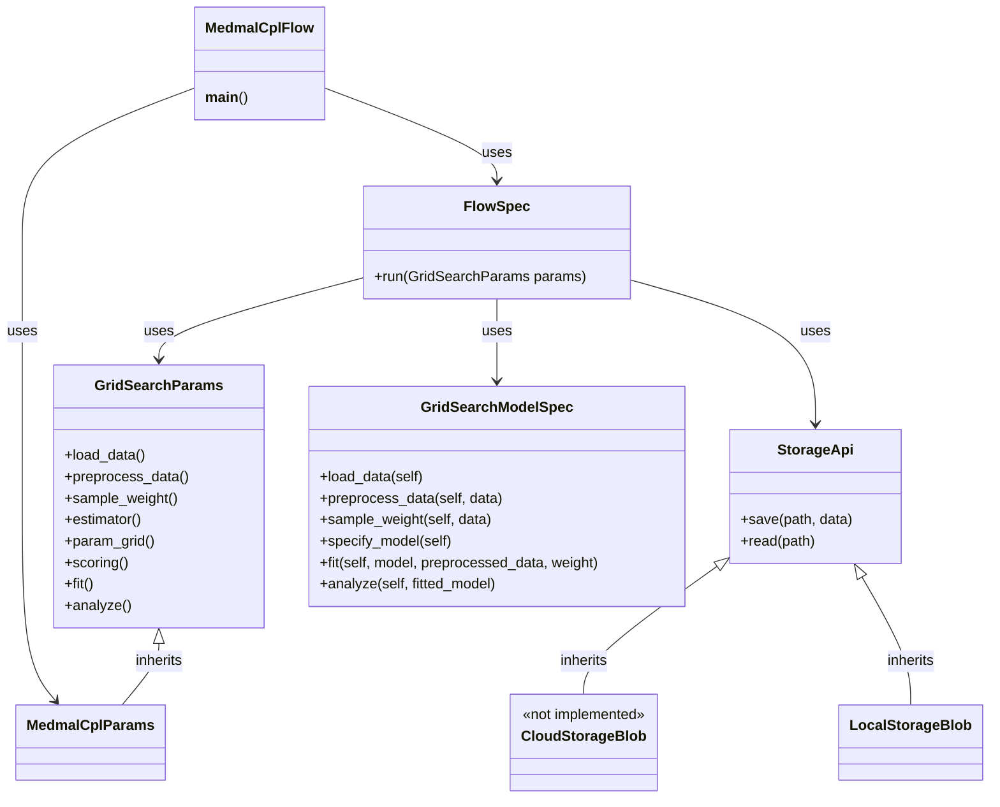
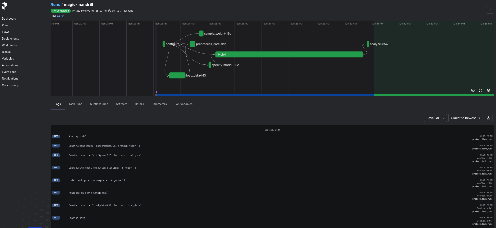

# Introduction

This project demonstrate a basic approach to implement a ChainLadder based model usin the Prefect workflow orchestrator project

# Environment Setup

To setup the environment, run the following commands in the project root directory:

```bash
. ./init.sh

./dev-env/30.start-prefect.sh
```

Then open another shell and run the following to sumbit a demo Benktander model pipeline to the Prefect server:

```bash
dev-env/40.submit-model.sh
```

The Prefect UI will be available at http://localhost:4200

# System Design

## Architecture

The system is designed to demonstrate a modular approach to constructing ChainLadder based models using pydantic and the 
Prefect workflow orchestrator. The system is composed of the following components:
* [MedmalCplFlow](./src/MedmalCplFlow.py)
  * Defines the chainLadder model pipeline as a composition of FlowSpec and MedmalCplParams instances. This is also the main entrypoint for the demo sumbit to Prefect
* [FlowSpec](./src/FlowSpec.py)
  * A top level generic helper class for constructing the model in a series of steps as Prefect tasks inside a flow.
* [StorageApi](./src/StorageApi.py)
  * StorageApi: Abstract base Prefect Block for a uniform blob storage Api
  * CloudStorageBlob: Not yet implemented
  * LocalStorageBlob: Basic local file system blob storage wrapping the built-in Prefect LocalFileSystem
* [MedmalCplParams](./src/ModelSpecs/MedmalCplParams.py)
  * Defines the chainLadder model pipeline configuration for loading data, speficifying model parameters, fitting and analyzing the model. This is a sub class of the generic GridSearchParams class
* [GridSearchParams](./src/LrModel/GridSearchParams.py)
  * Abstract base class defining a common interface for model construction parameters
* [GridSearchModelSpec](./src/LrModel/GridSearchModelSpec.py)
  * Similar to FlowSpec, this is a helper class for constructing a ChainLadder model in a series of steps as Prefect tasks inside a flow.

## System Diagram


## Data Flow

The demo model pipeline is constructed as a series of steps in the FlowSpec class. The steps are:
1. Load & pre-process data ([MedmalCplParams](./src/ModelSpecs/MedmalCplParams.py))
   1. Data is loaded from a sample dataset ('clrd') provided by the ChainLadder python package, grouped by LOB and summed
   2. The loaded dataset is pre-processed by selecting the medmal and CumPaidLoss features
2. Sample weights is obtained from the medmal and EarnedPremDIR features
3. A basic dev -> tail curve -> Benktander estimator pipeline is specified for the hyperparameter GridSearch
4. A range of iterations and apriori weights is specified for the GridSearch space
5. Scoring is selected as the IBNR on the Benktander model in the estimator pipeline
6. The model is fitted to the processed data using the specified GridSearch hyper parameter space
7. For analysis the model is pivoted with iterations for the index, apriori for the columns and IBNR for the values

The output of each Prefect step is written to json on local disk under [./.temp](./.temp). Unfortunaltely this is not surfaced in the Prefect UI

## Logging and Error Handling

Basic logging is impletented using the Prefect logging API with log statement in each task. The logs is surfaced in the Prefect UI. Error handling is not implemented in this demo

## Example flow execution

